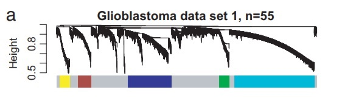
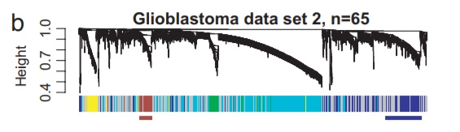
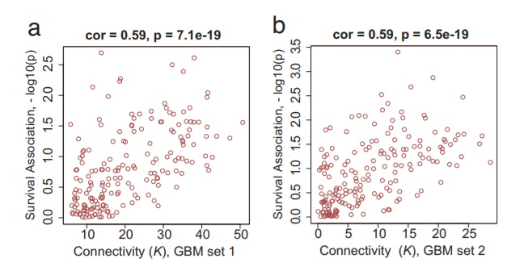

The paper that I will be replicating is "Analysis of oncogenic signaling networks in glioblastoma identifies *ASPM* as a molecular target" by Horvath et al. I am going to begin with some quick background. **Glioblastoma** is the most common type of brain tumour in adults, and one of the most lethal cancers (with a median survival time of 15 months, regardless of treatment). Back when this paper was published, people were only just starting to look at molecular targets for cancer drugs, and the field has expanded monumentally since 2006. Small molecule inhibitors are efficient drugs, especially in cancer, because they target proteins and enzymes that the cancer cells depend on to survive and proliferate. 

An example of a targeted molecule to inhibit is the **epidermal growth factor receptor (EGFR)**, whose pathway is shown below. As you can see, in normal conditions, the binding of a substrate to EGFR leads to signalling cascades with the ultimate effect of cell proliferation. If EGFR were over-expressed or mutated, then, one can see how it would lead to uncontrolled proliferation (which is a common feature of all cancer cells). At the time of publication, it had already been shown that EGFR is mutated in some way in many cases of glioblastoma and that inhibition of EGFR can, in fact, produce a clinical response in patients (meaning either that their survival time was longer than projected/expected or that the researchers observed tumour shrinkage, etc.). 


The goal of the paper was to identify potential drug targets to use in future studies using weighted gene co-expression network analysis (WGCNA). In broad terms, WGCNA is a way to correlate large sets of gene expression data into networks (usually scale-free) so that clusters of highly correlated genes can be easily detected. If we can find genes that are part of key biological pathways, they can be better targets for molecular therapies.

Just to go over some general network terminology before I begin, a network is composed of nodes (which would be the genes) and edges (how they interact and are connected). The specific type of network that WGCNA tries to generate is called a **scale free network**, and one of the defining characteristics of a scale free network is the presence of **hubs**, or highly connected nodes (more than what would be expected by chance) that are often part of the shortest path between any two nodes. Targeting hubs can be a double-edged sword in drug manufacture because they are involved in many different pathways, so while knocking them out would inhibit cancer cell growth, it could also inhibit pathways necessary for growth of healthy cells. (I have a .pdf file in my repository written by the paper authors that defines network components in more detail if my explanation is insufficient or confusing)

The raw data provided is gene expression data from two groups of patients. Data set 1 has n=55 and data set 2 has n=65; samples are RNA from 120 patients total. They used the expression data to generate a co-expression network based on Pearson correlations between expression profiles. The network then can be clustered to find groups of highly coexpressed genes, called **modules**. They measured the "gene significance" of the genes in each module, found that the brown module, corresponding to mistosis and the cell cycle, had the highest significance, and continued their analyses with only that module.

Because the data was arranged in a network-like format, the authors were able to pick out the nodes with the highest numbers of connections, aka the hubs. They decided to look into the *ASPM* gene because it was the most highly connected node that had not been previously identified as a target. *ASPM* has been highly studied in Drosophila (fruit fly) and has an ortholog in humans. The researchers noted that it looked as though *ASPM* was specific to only a few types of cancer, and that levels are highly elevated in glioblastoma, meaning that if inhibited, it would likely only act on the cancerous cells. They made correlation plots for the two data sets of survival time and gene significance. 

After identifying *ASPM* as a potential target, they show that inhibiting it with siRNAs does actually reduce proliferation of cells via cell cycle arrest. At a basic level, this paper lays the foundation for another group (or this same group) to develop a ASPM-inhibitor drug that is safe for human use. 

I will only be replicating a few of their analyses:

1. A pre-step to WGCNA involves setting a threshold for drawing an edge, otherwise genes connected very loosely and/or distantly would share an edge. I will be showing the statistics confirming that we have actually generated a scale-free network.

2. Creation of the network (in dendogram format) and module detection in both data sets.

3. Correlation plots of survival and gene connectivity for the mitosis and cell cycle module.

**NOTE**: There is a tutorial of this paper online, but I have not looked at/used it. Instead, I have relied on the Methods section of the paper and another, slightly different tutorial using genomic data from male and female mice livers (the data sets for this tutorial are on my repo). I think that the package has been updated since that tutorial was posted or the end-goal of the tutorial was different than in the paper I chose, so I thought it would be okay to use in order to familiarize myself with the package. I tried to find a WGCNA paper without a tutorial at all, but almost all of Horvath's major papers have a tutorial to go along with them, so I thought that this would be the next best option.

**Another note**: I was a little limited in what I could do with this paper because the breast cancer data that they compare their glioblastoma data sets to was too big for me to upload to my Github repository. I could have imported it via my Desktop but then there wouldn't be any way for you to run the code yourself. I looked at the file on my own to see if I could split it into two separate CSVs or delete any extra info given, but at the end of the day, I just didn't feel comfortable doing that with my limited knowledge of the data. 

```{r load data into Rstudio}
# a downside of WGCNA (in my opinion) is that it uses a TON of other packages that all need to be loaded into R
library(curl)
library(sna)
library(MASS)
library(class)
library(cluster)
library(splines)
library(Hmisc)
library(WGCNA)
options(stringsAsFactors = FALSE)
f <- curl("https://raw.githubusercontent.com/dantos17/data-reanalysis-assignment/master/GBM55and65and8000.csv")
d <- read.csv(f, header = TRUE, sep = ",", stringsAsFactors = FALSE)
head(d) #same method we've used all semester to get data files into R
# the file from the paper authors combines the data from the two experiments, so it is important that we separate them out to run the appropriate analyses
dataset1 <- t(d[,15:69])
dataset2 <- t(d[,70:134])
dSum <- d[,c(1:14)]
dim(dSum)
rm(d) # there is no need for d anymore because we have split up the expression data for the two data sets
thresholds <- c(seq(1, 10, 1), seq(12, 20, 2)) # the whole point of the table that this code is going to make and cutoff point is to generate the correct type of network, scale free
# scale free networks are commonly found in biological systems and pathways because they have several highly connected "hubs" that usually are part of the shortest path between any two nodes
RpowerTable <- pickSoftThreshold(dataset1, powerVector = thresholds)[[2]] #using a threshold helps construct a weighted network
cex1=0.7
par(mfrow=c(1,2))
plot(RpowerTable[,1], -sign(RpowerTable[,3])*RpowerTable[,2], xlab="Threshold",ylab="Scale Free Topology Model Fit,signed R^2",type="n")
text(RpowerTable[,1], -sign(RpowerTable[,3])*RpowerTable[,2], labels=thresholds,cex=cex1,col="red")
abline(h=0.95,col="red")
plot(RpowerTable[,1], RpowerTable[,5], xlab="Threshold", ylab="Mean Connectivity", type="n")
text(RpowerTable[,1], RpowerTable[,5], labels=thresholds, cex=cex1,col="red") # this line corresponds to the R-squared cutoff at 0.95. We should use 6 as our power because it's just above 0.95
power= 6
k_dataset1=softConnectivity(dataset1, power= power)-1
k_dataset2= softConnectivity(dataset2,power= power)-1 
par(mfrow=c(2,2))
scaleFreePlot(k_dataset1, main=paste("data set I, power=", power), truncated=F) # these plots quantify how well a certain power fits  desired network topology
scaleFreePlot(k_dataset2, main=paste("data set II, power=", power), truncated=F)
```

While these particular figures are not included in the paper, they are required steps in generating the network. Calculating the proper threshold and confirming it with an R-squared value is key in making a network that mirrors what actually happens in biological systems. These plots do not have counterparts in the published paper, but we can compare these results to the authors' by way of the similarity of the networks and modules that each analysis gives.

The next analysis that I am replicating is the actual network construction and module detection, and will correspond to Figure 1A in the Horvath paper. 
```{r Figure 1A}
# the following code is going to generate a dendogram via hierarchical clustering (think phylogenetic tree, in a way). The next step would be to select a cutoff for the clustering, ie, two nodes have to have a certain level of overlap to appear in the same cluster
# because we have 8000 genes in our dataset, we can make it so that the analysis only looks at the most highly connected genes, which is a number that we would have to define
kCut = 3600 #the cutoff point for our diagram is the 3600 most highly connected genes from data set 1
kRank = rank(-k_dataset1)
d1 <- apply(dataset1, 2 , var)
d2 <- apply(dataset2, 2, var)
restk <- kRank <= kCut & d1>0 & d2>0
sum(restk)
ADJdataOne=adjacency(datExpr= dataset1[,restk], power = power) #generating adjacency matrix
dissTOMdataset1 = TOMdist(ADJdataOne) #in general, "TOM" means topological overlap measure
hierTOMdataset1 = hclust(as.dist(dissTOMdataset1),method="average") # this is almost exactly the same as the code we used to make the UPGMA tree
par(mfrow=c(1,1))
plot(hierTOMdataset1, labels=F, main="Dendrogram, 3600 most connected in data set I only") 
# so here, the branches of the tree correspond to modules, we just have to trim them with the cutoff that we choose
colors <- cutreeStaticColor(hierTOMdataset1, cutHeight = 0.94, minSize = 125) # the colors correspond to genes in the same module, ex. blue would be one module
par(mfrow=c(2,1) ,mar=c(2,4,1,1))
plot(hierTOMdataset1, main="Glioblastoma data set 1, n=55", labels=F, xlab="", sub="")
plotColorUnderTree(hierTOMdataset1, colors=data.frame(module=colors))
table(colors)
```


The output here shows us both the dendrogram and the dendrogram plus that bottom color coded bar. Each black line in the top part of the diagram corresponds to a single gene, and the colored bar helps the reader to visualize what genes were found in a module (and what the module was). Gray colored sections correspond to genes that were not found to be part of any module. Figure 1A from the paper should appear below the coding output, and they look almost identical. It makes sense to me that the two figures are identical because the expression data always remains the same, and the way that the WGCNA package was written requires the data to be in a very specific format. Once the data is formatted correctly, the functions that the developers have written do the bulk of the work for you, so there isn't a lot of room for errors (at least with generating the results, interpreting them can be another story).

```{r Figure 1B}
#this code is pretty much the same as the previous chunk because we are doing the same thing except using data set 2
ADJdataTwo=adjacency(dataset2[,restk], power=power)
dissTOMdataset2=TOMdist(ADJdataTwo)
hierTOMdataset2 = hclust(as.dist(dissTOMdataset2),method="average")
par(mfrow=c(2,1),mar=c(2,4,1,1))
plot(hierTOMdataset2, main="Glioblastoma data set 2, n=65 ", labels=F, xlab="", sub="")
plotColorUnderTree(hierTOMdataset2,colors=data.frame(module=colors))
 # we are trying to compare the modules found in the first data set to the ones found in the second data set
# the data set 1 module colors are used in the clustering of data set 2, so even though the colors are jumbled around, we can see that a lot of the genes in data set 2 ARE colored, meaning that they were also found in a module in data set 1
```


I described this figure a little bit in my code annotation, but I'm going to go some more detail here. The top part of the diagram still corresponds to genes (this time from data set 2) and the colored bar still represents the different modules that the authors found. Because we are trying to make a co-expression network, though, instead of looking for new, unique modules found in data set 2, we use the same color scheme from data set 1 to visualize how many of the same genes are found in data set 2. Intuition says it should be a lot, if not all, of them considering that both data sets are coming from glioblastoma patients, but the color bar proves it. Again, Figure 1B looks pretty much identical to my replicated figure, and I am still hypothesizing that it is due to the specificity and automated nature of the package. I think that if I were using WGCNA for my own purposes, the hardest part of running the analyses would be cleaning and formatting my data correctly. 

The last analysis that I am going to replicate is generating the correlation plots between survival association and gene connectivity for the **brown module**. The reason that the authors use the brown module, aka genes that have roles in mitosis and the cell cycle, is (a) because our gene of interest, *ASPM*, is found in this module, and (b) because as we will see, the brown module has the highest correlation, meaning that successfully targeting a gene in this module does make a difference in survival, and that targeting a hub has an even greater impact.

```{r module significance}
# this step is a fancy way to predict survival, so we could see how different enriched modules affect the survival of glioblastoma patients
# significance = -log10(survival value); where survival value is calculated in the data summary
genesigdataOne <- -log10(dSum$pvalueCox55)[restk] #use 55 because data set 1 has 55 subjects
genesigdataTwo <- -log10(dSum$pvalueCox65)[restk] #65 corresponds to the number of subjects in data set 2

```

```{r correlation plots}
#data set 1
connectivitydataset1=intramodularConnectivity(ADJdataOne, colors=colors) #calculates connectivity of nodes WITHIN a module
names(connectivitydataset1) 
colorlevels=levels(factor(colors))
#data set 2
connectivitydataset2=intramodularConnectivity(ADJdataTwo,colors=colors)
names(connectivitydataset2)
colorlevels=levels(factor(colors))
# code to generate the plots; "whichmodule=" allows us to plot the data specifically for the brown module
par(mfrow=c(1,2))
whichmodule="brown";restrict1=colors==whichmodule
verboseScatterplot (connectivitydataset1$kWithin[restrict1], genesigdataOne[restrict1], col=colors[restrict1],xlab="Connectivity (k) - GBM set 1",ylab="Survival Association: – log10(p)")
verboseScatterplot (connectivitydataset2$kWithin[restrict1], genesigdataTwo[restrict1], col=colors[restrict1],xlab="Connectivity (k) - GBM set 2",ylab="Survival Association: – log10(p)")
hubs=10 
df=data.frame(GeneSymbol=dSum$Gene.Symbol[restk], connectivitydataset1)[colors=="brown",]
df[rank(-df$kWithin)<= hubs,c(1,3)] #gives us a list of the top 10 most highly connected nodes in the brown module 
```


Again, these correlation graphs plot node connectivity on the x axis and survival association (given by gene significance) on the y axis. You can easily see that for both data sets, nodes with a higher k (hubs) have a higher survival association. This should make sense because hubs are involved in so many different pathways that they end up being essential for survival. At first glance, the plots from the paper and the chunk output seem to be the same: the datapoints have a spread that is nearly identical in each set of plots. However, the cor and p values at the top of the graphs are not the same. I don't really know why this is, my only guess is that something in the way the functions were written causes the output to be slightly different for each user. I think that the difference is slight enough, however, that it would not make a huge difference in the significance of their findings. 
